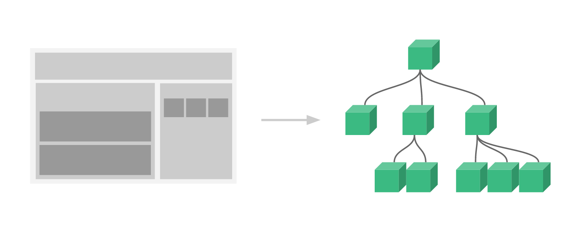
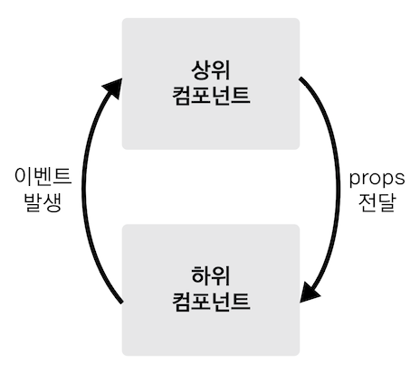

## Section04_vue_component :: Vue Component

### 1️⃣Vue Component
- <b>컴포넌트(component) : 화면의 영역을 구분하여 개발할 수 있는 뷰의 기능</b>
- 컴포넌트 기반으로 화면을 개발하면, 코드의 재사용성이 올라가고 빠르게 화면을 제작할 수 있음
- 하나의 화면을 여러 개의 파일로 분리하여 관리하는 것이 유지보수에 더 좋음


---
<br>


### 2️⃣Component 생성과 표시
**✅전역 component 등록**
```javascript
// 인스턴스 생성
var app = Vue.createApp();

app.component('컴포넌트 이름', {
  // 컴포넌트 내용
});
```
```javascript
// 인스턴스 생성
var app = Vue.createApp();

// 전역 컴포넌트 등록
app.component('app-header', {
  template: '<h1>Header Component</h1>'
});
```
<br>


**✅지역 component 등록**
- **옵션 api의 components를 사용하여 지역 컴포넌트를 등록**할 수 있음
```javascript
var 컴포넌트_내용_변수명 = {
  // 컴포넌트 내용
}

Vue.createApp({
  // 지역 컴포넌트 등록
  components: {
    '컴포넌트명': 컴포넌트_내용_변수명
  }
})
```
```javascript
var appHeader = {
  template: '<h1>Header Component</h1>'
}

Vue.createApp({
  // 지역 컴포넌트 등록
  components: {
    'app-header': appHeader
  }
})
```
<br>


**✅생성한 component 표시하기**
- HTML 부분에서 <b>생성한 컴포넌트명으로 컴포넌트 태그를 생성</b>
```html
<div id="app">
  <app-header></app-header>
</div>
```
---
<br>


### 3️⃣Component 통신 방식
- 뷰 컴포넌트는 각각 고유한 데이터 유효 범위를 가짐
- 컴포넌트 간 데이터를 주고받기 위하여 따라야 할 규칙이 존재함


- **props : 데이터는 상위에서 하위로 내려감**
- **event emit : 이벤트는 아래에서 위로 올려줌** <br>
여기서 이벤트는 ui에서 발생하는 이벤트가 아니라, 컴포넌트 간 통신을 위한 별도의 이벤트임